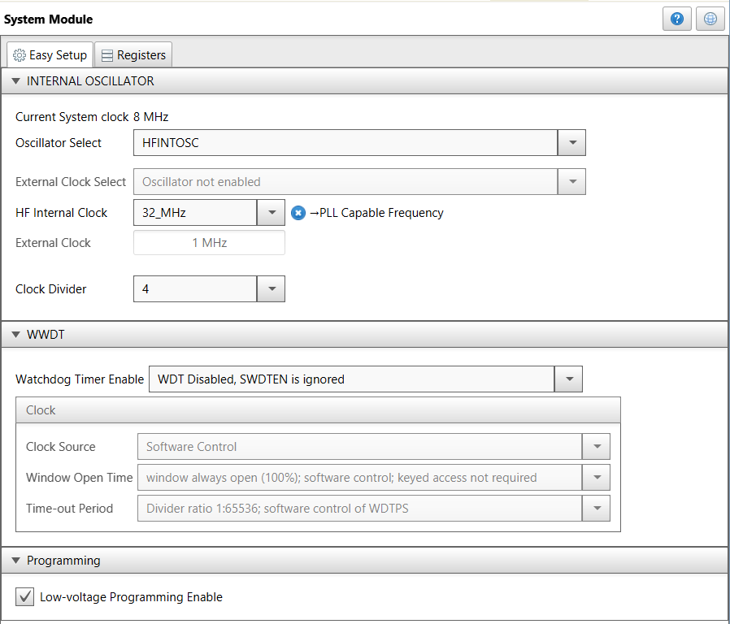
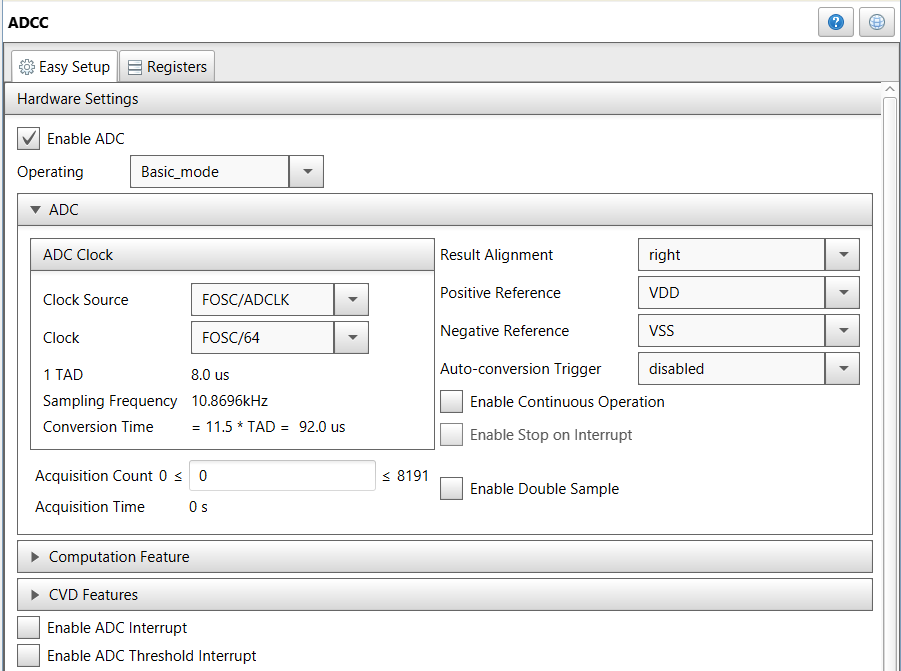
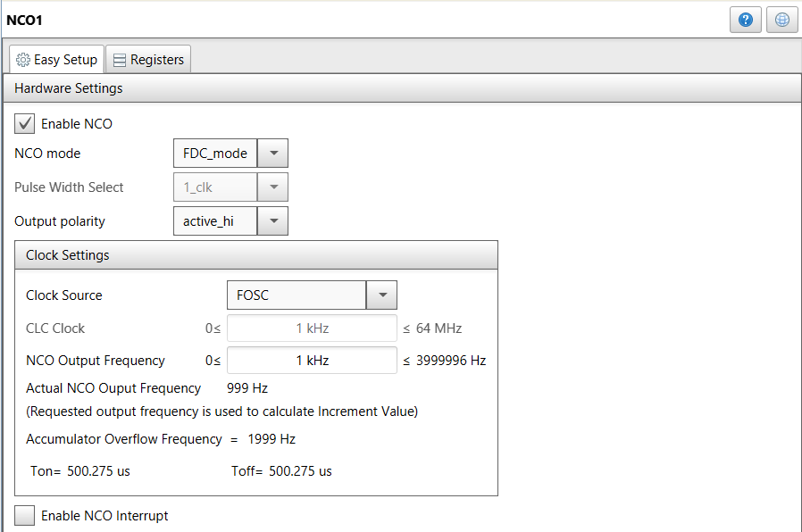
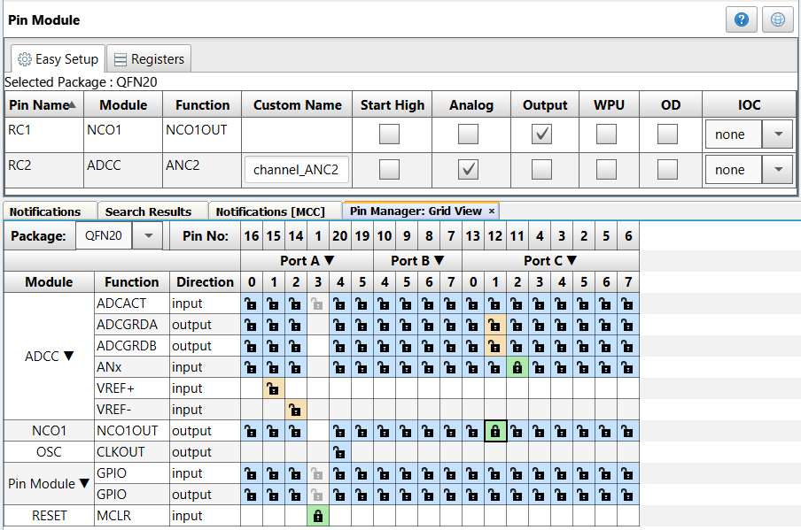
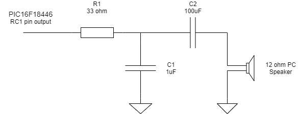
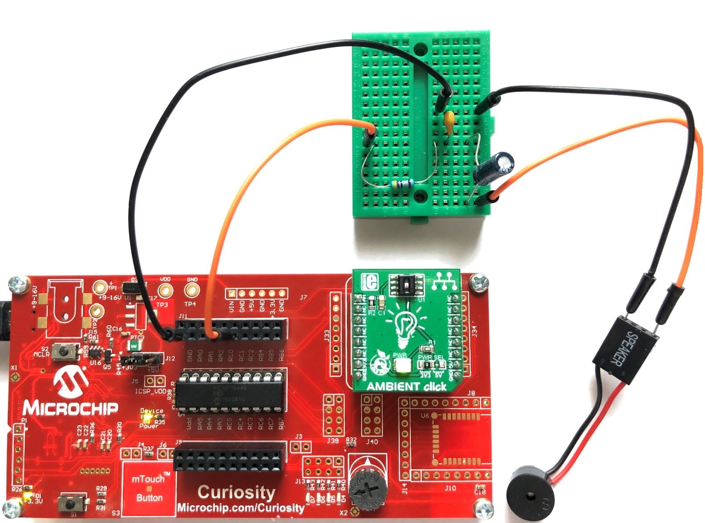

<div id="readme" class="Box-body readme blob js-code-block-container">
 <article class="markdown-body entry-content p-3 p-md-6" itemprop="text"><a href="https://www.microchip.com" rel="nofollow"></a>

# PIC16F18446 Ambient Light to Sound

The PIC16F18446 features a 12-bit ADC with Computation (ADCC) module. In this demo, the ADCC is used to read the Ambient Light Click Board™, then this value is used with an Numerically Controlled Oscillator (NCO) to generate a tone with variable pitch according to the light intensity.

## Related Documentation
- [PIC16F18446 Product Family Page](https://www.microchip.com/design-centers/8-bit/pic-mcus/device-selection/pic16f18446)
- [PIC16F18446 datasheet](http://ww1.microchip.com/downloads/en/DeviceDoc/40001985B.pdf) for more information or specifications.

## Software Used
- MPLAB® X IDE 5.30 or newer [(microchip.com/mplab/mplab-x-ide)](http://www.microchip.com/mplab/mplab-x-ide)
- MPLAB® XC8 2.10 or newer compiler [(microchip.com/mplab/compilers)](http://www.microchip.com/mplab/compilers)
- MPLAB® Code Configurator (MCC) 3.95.0 or newer [(microchip.com/mplab/mplab-code-configurator)](https://www.microchip.com/mplab/mplab-code-configurator)
- MPLAB® Code Configurator (MCC) PIC10/PIC12/PIC16/PIC18 library v1.79.0 or newer [(microchip.com/mplab/mplab-code-configurator)](https://www.microchip.com/mplab/mplab-code-configurator)

## Hardware Used
- PIC16F18446 PDIP20 with Curiosity Development Board [(DM164137)](https://www.microchip.com/Developmenttools/ProductDetails/DM164137)
- Alternatively PIC16F18446 Curiosity Nano [(DM164144)](https://www.microchip.com/DevelopmentTools/ProductDetails/PartNO/DM164144) with Curiosity Nano Base for Click Boards™ [(AC164162)](https://www.microchip.com/Developmenttools/ProductDetails/AC164162)
- Ambient Light click board™ [(MIKROE-1890)](https://www.mikroe.com/ambient-click)
- RC filter, wires and a small Breadboard for connections
- PC speaker (12 Ohm) or headphones (32 Ohm)

## Setup
This section shows the settings used in the demo for PIC16F18446 modules.
These were done using the Microchip Code Configurator (MCC). Open MCC to configure the modules:

### System Module Settings
The MCU uses the high frequency internal oscillator (HFINTOSC), and the clock is set to 8 MHz. 
Watchdog Timer is not used in this demo, so it is disabled.



### ADCC Settings
From Device Resources add ADCC peripheral, 
The ADCC is configured with a clock of FOSC/64, basic operation mode.



### NCO1 Settings
From Device Resources add NCO1 peripheral, it is used to generate variable pitch, 
Configure it with following options:

 


### Pin Module Setttings:
From Project Resources select Pin Module,
Configure it with following options:

  


The following pin configurations must be made for this project:

|Pin           | Configuration       |
| :----------: | :----------------:  |
|RC1           | Digital NCO1 output |
|RC2           | Analog ADCC input   |


### RC filter
The RC filter is composed of R1 (33 Ohm), C1 (1uF), C2 (100uF) for 12 Ohm PC Speaker:



In case of headphones (33 Ohm), the same schematic can be used, but increase R1 to 68 Ohms. 

### Add code to main.c file
Additional to the MCC configuration, go to main.c file, into void main function and add into `while(1)`:

```
    while (1)
    {
        // ADC Result = 0 .. 4095

        // For System Clock = 1 MHz -> NCO Max Freq = 500 KHz
        // Value for 20 KHz = 2^20 * 20 / 500 = 41943.04
        // Value for 20 Hz = 2^20 * 20 / 500000 = 41.94304 
        // factor = (41944 - 41) / 4095 ~= 10              
        //setNcoIncVal( 41 + adcVal*10 );

        // For System Clock = 8 MHz -> NCO Max Freq = 4 MHz
        // Value for 20 KHz = 2^20 * 20 / 4000 = 5242.88
        // Value for 20 Hz = 2^20 * 20 / 4000000 = 5.24288
        // factor = (5243 - 5) / 4095 ~= 1.28

        adcVal = ADCC_GetSingleConversion(channel_ANC2);
        NCO1INC = (5 + adcVal * 1.28);
    }
```

## Operation



1. Build demo firmware, make and program the generated code onto the PIC16F18446 MCU.
2. Plug the Ambient click board™ into the mikroBUS™ slot of the Curiosity board
3. Connect RC filter to RC1, GND as in the picture above, and also PC Speaker/Headphones to RC filter output and GND.
4. Listen to the PC Speaker/Headphones and you will hear a tone with variable pitch according to the light intensity.


## Summary

This project showcases how easy it is to use the PIC16F18446 and MCC to read a Ambient Light and generate a variable pitch according to the light intensity.
